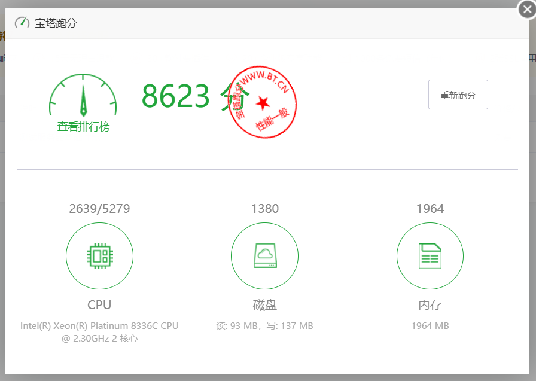

**云服务商**: 火山引擎（字节跳动）
**实例类型**: ECS  
**CPU**: Intel(R) Xeon(R) Platinum 8336C CPU @ 2.30GHz  
**配置**: 2C2G1M  
**IP/ASN**: AS137718（字节跳动多线）  
**机房位置**: 中国-北京
**其他**: 活动实例 29元首年

---
[https://paste.spiritlhl.net/#/show/xGp4p.txt](https://paste.spiritlhl.net/#/show/xGp4p.txt)
```
测评频道: https://t.me/vps_reviews                    
VPS融合怪版本：2025.08.15
Shell项目地址：https://github.com/spiritLHLS/ecs
Go项目地址 [推荐]：https://github.com/oneclickvirt/ecs
---------------------基础信息查询--感谢所有开源项目---------------------
 CPU 型号          : Intel(R) Xeon(R) Platinum 8336C CPU @ 2.30GHz
 CPU 核心数        : 2
 CPU 频率          : 2299.998 MHz
 CPU 缓存          : L1: 96.00 KB / L2: 2.50 MB / L3: 108.00 MB
 AES-NI指令集      : ✔ Enabled
 VM-x/AMD-V支持    : ❌ Disabled
 内存              : 981.71 MiB / 1.92 GiB
 Swap              : 0 KiB / 1.00 GiB
 硬盘空间          : 6.12 GiB / 39.08 GiB
 启动盘路径        : /dev/vda2
 系统在线时间      : 14 days, 22 hour 35 min
 负载              : 0.09, 0.08, 0.02
 系统              : Debian GNU/Linux 12 (bookworm) (x86_64)
 架构              : x86_64 (64 Bit)
 内核              : 6.1.0-18-amd64
 TCP加速方式       : cubic
 虚拟化架构        : KVM
 NAT类型           : Port Restricted Cone
 IPV4 ASN          : AS137718 Beijing Volcano Engine Technology Co., Ltd.
 IPV4 位置         : Beijing / Beijing / CN
----------------------CPU测试--通过sysbench测试-------------------------
 -> CPU 测试中 (Fast Mode, 1-Pass @ 5sec)
 1 线程测试(单核)得分: 		2376 Scores
 2 线程测试(多核)得分: 		4320 Scores
---------------------内存测试--感谢lemonbench开源-----------------------
 -> 内存测试 Test (Fast Mode, 1-Pass @ 5sec)
 单线程读测试:		20173.06 MB/s
 单线程写测试:		15688.03 MB/s
------------------磁盘dd读写测试--感谢lemonbench开源--------------------
 -> 磁盘IO测试中 (4K Block/1M Block, Direct Mode)
 测试操作		写速度					读速度
 100MB-4K Block		9.8 MB/s (2399 IOPS, 10.67s)		9.7 MB/s (2375 IOPS, 10.78s)
 1GB-1M Block		122 MB/s (117 IOPS, 8.56s)		111 MB/s (105 IOPS, 9.44s)
-------------IP质量检测--基于oneclickvirt/securityCheck使用-------------
数据仅作参考，不代表100%准确，如果和实际情况不一致请手动查询多个数据库比对
以下为各数据库编号，输出结果后将自带数据库来源对应的编号
ipinfo数据库  [0] | scamalytics数据库 [1] | virustotal数据库   [2] | abuseipdb数据库   [3] | ip2location数据库    [4]
ip-api数据库  [5] | ipwhois数据库     [6] | ipregistry数据库   [7] | ipdata数据库      [8] | db-ip数据库          [9]
ipapiis数据库 [A] | ipapicom数据库    [B] | bigdatacloud数据库 [C] | dkly数据库        [D] | ipqualityscore数据库 [E]
IPV4:
安全得分:
声誉(越高越好): 0 [2] 
信任得分(越高越好): 27 [8] 
VPN得分(越低越好): 25 [8] 
代理得分(越低越好): 93 [8] 
社区投票-无害: 0 [2]
社区投票-恶意: 0 [2] 
威胁得分(越低越好): 100 [8] 
欺诈得分(越低越好): 0 [1 E] 
Companny滥用得分(越低越好): 0.0025 (Low) [A] 
ASN滥用得分(越低越好): 0.0024 (Low) [A] 
公司滥用得分(越低越好): 0.0025 (Low) [A] 
威胁级别: low [9] 
黑名单记录统计:(有多少黑名单网站有记录):
无害记录数: 0 [2]  恶意记录数: 0 [2]  可疑记录数: 0 [2]  无记录数: 94 [2]  
安全信息:
使用类型: hosting [A] corporate [9] hosting - moderate probability [C] business [7 8]
公司类型: hosting [7 A] 
是否云提供商: Yes [7] 
是否数据中心: Yes [1 A] No [5 6 8 C]
是否移动设备: Yes [E] No [5 A C]
是否代理: No [1 4 5 6 7 8 9 A C E] 
是否VPN: No [1 6 7 A C E] 
是否Tor: No [1 6 7 8 A C E] 
是否Tor出口: No [1 7] 
是否网络爬虫: No [9 A E] 
是否匿名: No [1 6 7 8] 
是否攻击者: No [7 8] 
是否滥用者: No [7 8 A C E] 
是否威胁: No [7 8 C] 
是否中继: No [7 8 C] 
是否Bogon: No [7 8 A C] 
是否机器人: No [E] 
Google搜索可行性：NO
-------------邮件端口检测--基于oneclickvirt/portchecker开源-------------
Platform  SMTP  SMTPS POP3  POP3S IMAP  IMAPS
LocalPort ✔     ✔     ✔     ✔     ✔     ✔    
QQ        ✔     ✔     ✔     ✘     ✔     ✘    
163       ✔     ✔     ✔     ✘     ✔     ✘    
Sohu      ✔     ✔     ✔     ✘     ✔     ✘    
Yandex    ✔     ✔     ✔     ✘     ✔     ✘    
Gmail     ✘     ✘     ✘     ✘     ✘     ✘    
Outlook   ✔     ✘     ✔     ✘     ✔     ✘    
Office365 ✔     ✘     ✔     ✘     ✔     ✘    
Yahoo     ✘     ✘     ✘     ✘     ✘     ✘    
MailCOM   ✔     ✔     ✔     ✘     ✔     ✘    
MailRU    ✔     ✔     ✘     ✘     ✔     ✘    
AOL       ✘     ✘     ✘     ✘     ✘     ✘    
GMX       ✔     ✔     ✔     ✘     ✔     ✘    
Sina      ✔     ✘     ✔     ✘     ✔     ✘    
Apple     ✘     ✘     ✘     ✘     ✘     ✘    
FastMail  ✘     ✔     ✘     ✘     ✘     ✘    
ProtonMail✘     ✘     ✘     ✘     ✘     ✘    
MXRoute   ✔     ✘     ✔     ✘     ✔     ✘    
Namecrane ✘     ✔     ✔     ✘     ✔     ✘    
XYAMail   ✘     ✘     ✘     ✘     ✘     ✘    
ZohoMail  ✘     ✔     ✘     ✘     ✘     ✘    
Inbox_eu  ✔     ✔     ✔     ✘     ✘     ✘    
Free_fr   ✘     ✔     ✔     ✘     ✔     ✘    
-----------------------全国延迟检测--本脚本原创-------------------------
 联通太原	   9   | 联通上海	   24  | 联通福州	   39  |
 电信南京	   25  | 电信武汉	   23  | 电信扬州	   23  |
 电信苏州	   25  | 电信杭州	   29  | 电信Zhenjiang	   25  |
 移动杭州	   24  | 移动成都	   41  | 移动福州	   41  |
--------------------自动更新测速节点列表--本脚本原创--------------------
位置		 上传速度	 下载速度	 延迟
Speedtest.net	 1.08Mbps	 9.66Mbps	 20.81ms	
中国香港	 0.92Mbps	 2.85Mbps	 51.68ms	
日本东京	 0.83Mbps	 1.94Mbps	 76.47ms	
联通上海5G	 0.94Mbps	 9.56Mbps	 27.97ms	
电信Suzhou5G	 0.87Mbps	 9.59Mbps	 36.39ms	
电信Zhenjiang5G	 0.64Mbps	 9.41Mbps	 36.03ms	
移动Suzhou	 0.58Mbps	 0.06Mbps	 224.00ms	
------------------------------------------------------------------------
 总共花费      : 12 分 21 秒
 时间          : Fri Aug 29 00:10:44 CST 2025
------------------------------------------------------------------------
```
# 宝塔跑分
