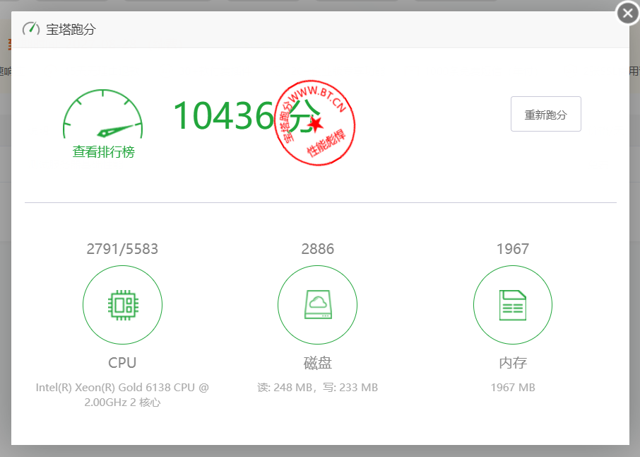

**云服务商**: 浪浪云  
**实例类型**: 轻量级  
**CPU**: Intel(R) Xeon(R) Gold 6138 CPU @ 2.00GHz   
**配置**: 2C2G10M    
**IP/ASN**: AS138995（antboxnetworks.com香港）（192.238.232.55）  
**机房位置**: 美国-加利福尼亚-洛杉矶  
**其他**: 美国A1区  

---
[https://paste.spiritlhl.net/#/show/ROJ8u.txt](https://paste.spiritlhl.net/#/show/ROJ8u.txt)
```
测评频道: https://t.me/vps_reviews                    
VPS融合怪版本：2025.08.15
Shell项目地址：https://github.com/spiritLHLS/ecs
Go项目地址 [推荐]：https://github.com/oneclickvirt/ecs
---------------------基础信息查询--感谢所有开源项目---------------------
 CPU 型号          : Intel(R) Xeon(R) Gold 6138 CPU @ 2.00GHz
 CPU 核心数        : 2
 CPU 频率          : 1995.312 MHz
 CPU 缓存          : L1: 32.00 KB / L2: 1.00 MB / L3: 27.50 MB
 AES-NI指令集      : ✔ Enabled
 VM-x/AMD-V支持    : ✔ Enabled
 内存              : 993.92 MiB / 1.92 GiB
 Swap              : 421.65 MiB / 1.00 GiB
 硬盘空间          : 18.00 GiB / 28.89 GiB
 启动盘路径        : /dev/vda1
 系统在线时间      : 2 days, 18 hour 25 min
 负载              : 1.05, 0.35, 0.12
 系统              : Ubuntu 24.04.1 LTS (x86_64)
 架构              : x86_64 (64 Bit)
 内核              : 6.8.0-78-generic
 TCP加速方式       : cubic
 虚拟化架构        : KVM
 NAT类型           : Full Cone
 IPV4 ASN          : AS138995 Antbox Networks Limited
 IPV4 位置         : Los Angeles / California / US
----------------------CPU测试--通过sysbench测试-------------------------
 -> CPU 测试中 (Fast Mode, 1-Pass @ 5sec)
 1 线程测试(单核)得分: 		906 Scores
 2 线程测试(多核)得分: 		1748 Scores
---------------------内存测试--感谢lemonbench开源-----------------------
 -> 内存测试 Test (Fast Mode, 1-Pass @ 5sec)
 单线程读测试:		17903.92 MB/s
 单线程写测试:		14845.82 MB/s
------------------磁盘dd读写测试--感谢lemonbench开源--------------------
 -> 磁盘IO测试中 (4K Block/1M Block, Direct Mode)
 测试操作		写速度					读速度
 100MB-4K Block		10.8 MB/s (2647 IOPS, 9.67s)		10.5 MB/s (2560 IOPS, 10.00s)
 1GB-1M Block		262 MB/s (250 IOPS, 4.00s)		262 MB/s (250 IOPS, 4.00s)
---------------------磁盘fio读写测试--感谢yabs开源----------------------
Block Size | 4k            (IOPS) | 64k           (IOPS)
  ------   | ---            ----  | ----           ---- 
Read       | 9.86 MB/s     (2.4k) | 156.61 MB/s   (2.4k)
Write      | 9.89 MB/s     (2.4k) | 157.44 MB/s   (2.4k)
Total      | 19.75 MB/s    (4.9k) | 314.06 MB/s   (4.9k)
           |                      |                     
Block Size | 512k          (IOPS) | 1m            (IOPS)
  ------   | ---            ----  | ----           ---- 
Read       | 214.94 MB/s    (419) | 199.76 MB/s    (195)
Write      | 226.37 MB/s    (442) | 213.06 MB/s    (208)
Total      | 441.31 MB/s    (861) | 412.82 MB/s    (403)
------------流媒体解锁--基于oneclickvirt/CommonMediaTests开源-----------
以下测试的解锁地区是准确的，但是不是完整解锁的判断可能有误，这方面仅作参考使用
----------------Netflix-----------------
[IPV4]
您的出口IP完整解锁Netflix，支持非自制剧的观看
NF所识别的IP地域信息：美国
[IPV6]
您的网络可能没有正常配置IPv6，或者没有IPv6网络接入
----------------Youtube-----------------
[IPV4]
连接方式: Youtube Video Server
视频缓存节点地域: 美国  洛杉机(LAX17S56)
Youtube识别地域: 中国香港(HK)
[IPV6]
Youtube在您的出口IP所在的国家不提供服务
---------------DisneyPlus---------------
[IPV4]
当前IPv4出口所在地区即将开通DisneyPlus
[IPV6]
DisneyPlus在您的出口IP所在的国家不提供服务
解锁Netflix，Youtube，DisneyPlus上面和下面进行比较，不同之处自行判断
----------------流媒体解锁--感谢RegionRestrictionCheck开源--------------
 以下为IPV4网络测试，若无IPV4网络则无输出
============[ Multination ]============
 Dazn:					Yes (Region: US)
 Disney+:				No
 Netflix:				Yes (Region: US)
 YouTube Premium:			Yes (Region: HK)
 Amazon Prime Video:			No (Service Not Available)
 TVBAnywhere+:				Yes
 Spotify Registration:			No
 OneTrust Region:			US [California]
 iQyi Oversea Region:			US
 Bing Region:				US (Risky)
 Apple Region:				CN
 YouTube CDN:				Los Angeles, CA
 Netflix Preferred CDN:			Los Angeles, CA
 ChatGPT:				Yes
 Google Gemini:				No
 Claude:				Yes
 Wikipedia Editability:			Yes
 Google Play Store:			Hong Kong 
 Google Search CAPTCHA Free:		Yes
 Steam Currency:			USD
 ---Forum---
 Reddit:				Yes
 ---Game---
 SD Gundam G Generation Eternal:	Yes
=======================================
 以下为IPV6网络测试，若无IPV6网络则无输出
--------------------TikTok解锁--感谢lmc999的源脚本----------------------
 Tiktok Region:		【US】
-------------IP质量检测--基于oneclickvirt/securityCheck使用-------------
数据仅作参考，不代表100%准确，如果和实际情况不一致请手动查询多个数据库比对
以下为各数据库编号，输出结果后将自带数据库来源对应的编号
ipinfo数据库  [0] | scamalytics数据库 [1] | virustotal数据库   [2] | abuseipdb数据库   [3] | ip2location数据库    [4]
ip-api数据库  [5] | ipwhois数据库     [6] | ipregistry数据库   [7] | ipdata数据库      [8] | db-ip数据库          [9]
ipapiis数据库 [A] | ipapicom数据库    [B] | bigdatacloud数据库 [C] | dkly数据库        [D] | ipqualityscore数据库 [E]
IPV4:
安全得分:
声誉(越高越好): 0 [2] 
信任得分(越高越好): 0 [8] 
VPN得分(越低越好): 99 [8] 
代理得分(越低越好): 100 [8] 
社区投票-无害: 0 [2] 
社区投票-恶意: 0 [2]
威胁得分(越低越好): 100 [8] 
欺诈得分(越低越好): 0 [1 E] 
滥用得分(越低越好): 0 [3] 
ASN滥用得分(越低越好): 0.0008 (Low) [A] 
公司滥用得分(越低越好): 0.0008 (Low) [A] 
威胁级别: low [9] 
黑名单记录统计:(有多少黑名单网站有记录):
无害记录数: 0 [2]  恶意记录数: 0 [2]  可疑记录数: 0 [2]  无记录数: 94 [2]  
安全信息:
使用类型: DataCenter/WebHosting/Transit [3] hosting - moderate probability [C] business [8] corporate [9] hosting [0 7 A]
公司类型: hosting [0 7 A] 
是否云提供商: Yes [7] 
是否数据中心: No [5 6 8 C] Yes [0 1 A]
是否移动设备: No [5 A C] Yes [E]
是否代理: No [0 1 4 5 6 7 8 9 A C E] 
是否VPN: No [0 1 6 7 A C E] 
是否TorExit: No [1 7] 
是否Tor出口: No [1 7] 
是否网络爬虫: No [9 A E] 
是否匿名: No [1 6 7 8] 
是否攻击者: No [7 8] 
是否滥用者: No [7 8 A C E] 
是否威胁: No [7 8 C] 
是否中继: No [0 7 8 C] 
是否Bogon: No [7 8 A C] 
是否机器人: No [E] 
DNS-黑名单: 315(Total_Check) 0(Clean) 4(Blacklisted) 19(Other) 
Google搜索可行性：NO
-------------邮件端口检测--基于oneclickvirt/portchecker开源-------------
Platform  SMTP  SMTPS POP3  POP3S IMAP  IMAPS
LocalPort ✔     ✔     ✔     ✔     ✔     ✔    
QQ        ✔     ✔     ✔     ✘     ✔     ✘    
163       ✔     ✔     ✔     ✘     ✔     ✘    
Sohu      ✔     ✔     ✔     ✘     ✔     ✘    
Yandex    ✔     ✔     ✔     ✘     ✔     ✘    
Gmail     ✔     ✔     ✘     ✘     ✘     ✘    
Outlook   ✔     ✘     ✔     ✘     ✔     ✘    
Office365 ✔     ✘     ✔     ✘     ✔     ✘    
Yahoo     ✔     ✔     ✘     ✘     ✘     ✘    
MailCOM   ✔     ✔     ✔     ✘     ✔     ✘    
MailRU    ✔     ✔     ✘     ✘     ✔     ✘    
AOL       ✔     ✔     ✘     ✘     ✘     ✘    
GMX       ✔     ✔     ✔     ✘     ✔     ✘    
Sina      ✔     ✘     ✔     ✘     ✔     ✘    
Apple     ✘     ✘     ✘     ✘     ✘     ✘    
FastMail  ✘     ✔     ✘     ✘     ✘     ✘    
ProtonMail✘     ✘     ✘     ✘     ✘     ✘    
MXRoute   ✔     ✘     ✔     ✘     ✔     ✘    
Namecrane ✘     ✘     ✔     ✘     ✔     ✘    
XYAMail   ✘     ✘     ✘     ✘     ✘     ✘    
ZohoMail  ✘     ✔     ✘     ✘     ✘     ✘    
Inbox_eu  ✔     ✔     ✔     ✘     ✘     ✘    
Free_fr   ✘     ✔     ✔     ✘     ✔     ✘    
-------------上游及三网回程--基于oneclickvirt/backtrace开源-------------
国家: US 城市: Los Angeles 服务商: AS138995 Antbox Networks Limited
北京电信v4 219.141.140.10  检测不到回程路由节点的IP地址
北京联通v4 202.106.195.68  检测不到回程路由节点的IP地址
北京移动v4 221.179.155.161 检测不到回程路由节点的IPV4地址
上海电信v4 202.96.209.133  检测不到回程路由节点的IPV4地址
上海联通v4 210.22.97.1     检测不到回程路由节点的IPV4地址
上海移动v4 211.136.112.200 检测不到回程路由节点的IPV4地址
广州电信v4 58.60.188.222   检测不到回程路由节点的IP地址
广州联通v4 210.21.196.6    检测不到回程路由节点的IPV4地址
广州移动v4 120.196.165.24  检测不到回程路由节点的IPV4地址
成都电信v4 61.139.2.69     检测不到回程路由节点的IP地址
成都联通v4 119.6.6.6       检测不到回程路由节点的IPV4地址
成都移动v4 211.137.96.205  检测不到回程路由节点的IPV4地址
准确线路自行查看详细路由，本测试结果仅作参考
同一目标地址多个线路时，检测可能已越过汇聚层，除第一个线路外，后续信息可能无效
-----------------------回程路由--基于nexttrace开源----------------------
依次测试电信/联通/移动经过的地区及线路，核心程序来自nexttrace，请知悉!
广州电信 58.60.188.222
 	
广州联通 210.21.196.6
174.32 ms 	AS17623 中国 广东 深圳 宝安区 chinaunicom.cn 联通
广州移动 120.196.165.24
174.80 ms 	AS56040 [APNIC-AP] 中国 广东 深圳 gd.10086.cn 移动
--------------------自动更新测速节点列表--本脚本原创--------------------
位置		 上传速度	 下载速度	 延迟
Speedtest.net	 9.65Mbps	 95.54Mbps	 690.76ms	
日本东京	 9.42Mbps	 52.07Mbps	 113.65ms	
法兰克福	 9.38Mbps	 32.09Mbps	 149.65ms	
联通上海5G	 8.34Mbps	 21.98Mbps	 203.39ms	
电信Zhenjiang5G	 8.96Mbps	 43.15Mbps	 189.62ms	
电信Suzhou5G	 8.53Mbps	 39.13Mbps	 157.15ms	
移动Suzhou	 1.26Mbps	 0.07Mbps	 609.72ms	
------------------------------------------------------------------------
 总共花费      : 7 分 30 秒
 时间          : Thu Aug 28 16:11:04 UTC 2025
------------------------------------------------------------------------
```
# 宝塔跑分
